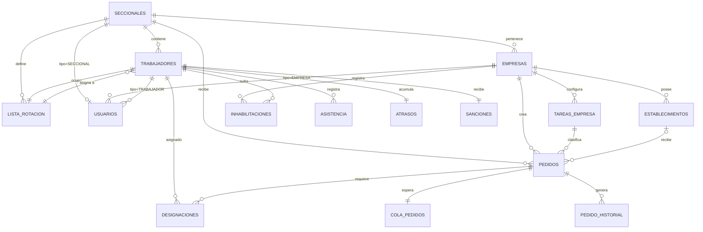

# Diagrama ER — Modelo de Datos

# Sistema Web de Gestión y Asignación de Personal Eventual para UATRE

**Propósito:** Visualizar la estructura de 15 tablas y sus relaciones.

---

## Diagrama Entidad-Relación (Mermaid)



---

## Categorías de Tablas

### **Tablas Core (Estructura base)**
- `SECCIONALES` — Sedes de UATRE
- `EMPRESAS` — Empresas afiliadas
- `ESTABLECIMIENTOS` — Direcciones o lugares de trabajo de las empresas
- `TAREAS_EMPRESA` — Tipos de trabajo configurados por empresa
- `TRABAJADORES` — Socios/trabajadores
- `USUARIOS` — Login centralizado
- `LISTA_ROTACION` — Números fijos de rotación

### **Tablas de Estados (Condiciones)**
- `ASISTENCIA` — Registro diario de presencia
- `ATRASOS` — Turnos atrasados acumulados
- `SANCIONES` — Turnos de sanción pendientes
- `INHABILITACIONES` — Excepciones de habilitación

### **Tablas de Operación (Flujo)**
- `PEDIDOS` — Solicitudes de personal
- `COLA_PEDIDOS` — Pedidos en espera
- `DESIGNACIONES` — Asignaciones de trabajadores
- `PEDIDO_HISTORIAL` — Histórico diario

---

## Relaciones principales

| De | A | Tipo | Descripción |
|----|----|------|-------------|
| SECCIONALES | EMPRESAS | 1:N | Cada seccional tiene N empresas |
| SECCIONALES | TRABAJADORES | 1:N | Cada seccional tiene N trabajadores |
| SECCIONALES | LISTA_ROTACION | 1:N | Cada seccional define su lista |
| SECCIONALES | PEDIDOS | 1:N | Cada seccional recibe N pedidos |
| EMPRESAS | PEDIDOS | 1:N | Cada empresa crea N pedidos |
| EMPRESAS | ESTABLECIMIENTOS | 1:N | Cada empresa administra sus establecimientos |
| EMPRESAS | TAREAS_EMPRESA | 1:N | Cada empresa dispone de tareas configurables |
| TAREAS_EMPRESA | PEDIDOS | 1:N | Cada pedido solicita una tarea de su empresa |
| ESTABLECIMIENTOS | PEDIDOS | 0..N | Un pedido puede indicar un establecimiento de su empresa |
| TRABAJADORES | DESIGNACIONES | 1:N | Cada trabajador tiene N designaciones |
| PEDIDOS | DESIGNACIONES | 1:N | Cada pedido requiere N designaciones |
| PEDIDOS | COLA_PEDIDOS | 0..1 | Un pedido en máximo 1 cola |
| SECCIONALES | USUARIOS | 1:0..1 | Una única cuenta de acceso por seccional |
| EMPRESAS | USUARIOS | 1:N | Cuentas asociadas a una empresa, según tipo EMPRESA |
| TRABAJADORES | USUARIOS | 1:N | Cuentas asociadas a un trabajador, según tipo TRABAJADOR |

---

## Características de normalización

### **UNIQUE constraints**
- `SECCIONALES.numero` — Número de seccional único
- `TRABAJADORES.documento` — Documento único global
- `USUARIOS.email` — Email único global
- `USUARIOS.seccional_id` (parcial, tipo SECCIONAL) — Un usuario por seccional
- `ESTABLECIMIENTOS (empresa_id, nombre)` — Un establecimiento único por empresa
- `TAREAS_EMPRESA (empresa_id, nombre)` — Una tarea única por empresa
- `LISTA_ROTACION (seccional_id, numero)` — Un número por seccional
- `ASISTENCIA (trabajador_id, fecha)` — Un registro por trabajador y día
- `ATRASOS.trabajador_id` — Un registro por trabajador
- `SANCIONES.trabajador_id` — Un registro por trabajador
- `INHABILITACIONES (trabajador_id, empresa_id)` — Una inhabilitación por par
- `DESIGNACIONES (pedido_id, trabajador_id)` — Una designación por par
- `COLA_PEDIDOS.pedido_id` — Un pedido máximo en una cola

### **CHECK constraints**
- `USUARIOS.tipo IN ('SECCIONAL', 'EMPRESA', 'TRABAJADOR')`
- `PEDIDOS.estado IN ('PENDIENTE', 'EN_PROCESO', 'CUBIERTO', 'NO_CUBIERTO', 'CANCELADO')`
- `COLA_PEDIDOS.estado IN ('PENDIENTE', 'PROCESADO', 'CANCELADO')`
- `DESIGNACIONES.estado IN ('DESIGNADO', 'TRABAJANDO', 'FINALIZADO', 'CANCELADO')`

---

## Índices clave

| Tabla | Índice | Tipo | Propósito |
|-------|--------|------|-----------|
| TRABAJADORES | idx_trab_elegibles | Partial | Motor: presentes hoy+ayer |
| TRABAJADORES | idx_trab_excepcional_* | Partial | Motor: excepciones etapas 1-3 |
| ATRASOS | idx_atrasos_prioridad | Partial | Motor: ordenar por cantidad |
| DESIGNACIONES | idx_designaciones_activas | Partial | Verificar ocupación |
| COLA_PEDIDOS | idx_cola_pendientes | Partial | Procesar por fecha |
| PEDIDOS | idx_pedidos_activos | Partial | Listar pedidos en proceso |

---

## Flujo de datos principal

```
EMPRESA crea PEDIDO
    ↓
fn_decidir_procesamiento_pedido() [TRIGGER]
    ↓
¿INMEDIATO o COLA?
    ├─ INMEDIATO → PEDIDO.estado = EN_PROCESO
    └─ COLA → COLA_PEDIDOS + PEDIDO.estado = PENDIENTE
    ↓
fn_ejecutar_motor(pedido_id)
    ↓
Evalúa TRABAJADORES de LISTA_ROTACION
    ├─ Fase 1: ATRASADOS elegibles
    ├─ Fase 2: ROTACION ordinaria
    └─ Fase 3: COBERTURA excepcional
    ↓
INSERT DESIGNACIONES
    ↓ [Trigger: trg_descontar_atraso_al_designar]
UPDATE ATRASOS.cantidad -= 1
    ↓
Actualiza PEDIDOS.estado = CUBIERTO|NO_CUBIERTO
    ↓
INSERT PEDIDO_HISTORIAL [cierre de jornada]
```

---

**Versión:** 1.0  
**Fecha:** 2026-09-22  
**Referencias:** RN-001 a RN-165, base_datos.md, database-sql.md
