# Diagrama Asistencia — Flujo de Toma y Cierre

# Sistema Web de Gestión y Asignación de Personal Eventual para UATRE

**Propósito:** Visualizar el proceso manual de asistencia en cuadrícula y los eventos disparados al cerrar.

**Reglas relacionadas:** RN-023, RN-024, RN-025, RN-018, RN-022, RN-166, RN-167

---

## Flujo completo de Asistencia

```mermaid
graph TD
    Start["UATRE abre apartado de ASISTENCIA"] --> Query["Sistema consulta TRABAJADORES activos<br/>de la seccional para HOY"]
    Query --> CreateRecs["Crea registros en ASISTENCIA<br/>trabajador_id, fecha=HOY, presente=FALSE, cerrado=FALSE<br/>(los flags NO se resetean al abrir, A-28/D-02)"]
    
    CreateRecs --> Display["Muestra CUADRÍCULA:<br/>Número | Trabajador | Estado"]
    
    Display --> Interact["UATRE interactúa con casilleros"]
    Interact --> SingleTap["Toque simple<br/>= PRESENTE"]
    Interact --> LongHold["Pulsación sostenida<br/>= Menú (PRESENTE/AUSENTE/ANOTADO)"]
    
    SingleTap --> Update1["UPDATE asistencia.presente = TRUE"]
    LongHold --> Update2["UPDATE asistencia.presente = SELECCIONADO"]
    
    Update1 --> Verify["¿Todos los números verificados?"]
    Update2 --> Verify
    
    Verify -->|No| Interact
    Verify -->|Sí| Enable["Habilita botón CERRAR ASISTENCIA<br/>(solo después de 07:40 hs)"]
    
    Enable --> TimeCheck{"¿Hora >= 07:40?"}
    TimeCheck -->|No| Wait["Espera a las 07:40"]
    Wait --> TimeCheck
    TimeCheck -->|Sí| Click["UATRE hace clic en CERRAR ASISTENCIA"]
    
    Click --> MarkClosed["UPDATE asistencia.cerrado = TRUE<br/>para todos los registros"]
    
    MarkClosed --> T1["<b>Trigger 1: trg_sync_presente_flags</b><br/>AFTER INSERT OR UPDATE ON asistencia<br/>WHERE cerrado = TRUE"]
    
    T1 --> SyncLogic["Para cada TRABAJADOR:<br/>• presente_ayer = presente_hoy<br/>• presente_hoy = NEW.presente"]
    
    SyncLogic --> T9["<b>Trigger 9: trg_descuento_atraso_ausencia</b><br/>AFTER INSERT OR UPDATE ON asistencia<br/>WHERE cerrado = TRUE"]
    
    T9 --> CheckAusente{"¿presente = FALSE<br/>(AUSENTE)?"}
    CheckAusente -->|No| SkipAtraso["No descuenta atrasos"]
    CheckAusente -->|Sí| HasAtrasos{"¿Tiene atrasos > 0?"}
    
    HasAtrasos -->|No| SkipAtraso
    HasAtrasos -->|Sí| Descuenta["UPDATE atrasos.cantidad -= 1<br/>(máximo 1 por trabajador y jornada)"]
    
    Descuenta --> MotorStart["<b>Motor inicia automáticamente</b>"]
    SkipAtraso --> MotorStart
    
    MotorStart --> ProcesoCola["Procesa COLA_PEDIDOS<br/>con fecha_procesamiento_programado <= NOW()"]
    
    ProcesoCola --> EjecutaMotor["fn_ejecutar_motor(pedido_id) para cada pedido<br/>en orden FIFO"]
    
    EjecutaMotor --> Designa["Crea DESIGNACIONES<br/>según fases 1 y 2 del motor<br/>(cobertura excepcional manual, D-06)"]
    
    Designa --> T5["<b>Trigger 5: trg_descontar_atraso_al_designar</b><br/>AFTER INSERT ON designaciones<br/>Descuenta 1 atraso si tenía"]
    
    T5 --> End["✅ Asistencia cerrada<br/>✅ Flags sincronizados<br/>✅ Atrasos actualizados<br/>✅ Pedidos procesados"]
    
    style Start fill:#e1f5ff
    style Display fill:#fff3e0
    style Enable fill:#f3e5f5
    style Click fill:#e8f5e9
    style End fill:#c8e6c9
    style T1 fill:#ffccbc
    style T9 fill:#ffccbc
    style T5 fill:#ffccbc
    style MotorStart fill:#b3e5fc
```



---

## Estados visuales en cuadrícula

```
┌─────────────────────────────────────┐
│ CUADRÍCULA DE ASISTENCIA - HOY      │
├─────────┬──────────────────┬────────┤
│ Número  │ Trabajador       │ Estado │
├─────────┼──────────────────┼────────┤
│   1     │ Juan García      │ 🟢 P   │  (Verde = PRESENTE)
│   2     │ María López      │ 🔴 A   │  (Rojo = AUSENTE)
│   3     │ Carlos Rodríguez │ 🟡 T   │  (Amarillo = TRABAJANDO)
│   4     │ Ana Martínez     │ 🔵 At  │  (Azul = ATRASADO)
│   5     │ Pedro Sánchez    │ ⚪ An  │  (Gris = ANOTADO)
│   6     │ [Libre]          │ ◻️  -   │  (Blanco = Número libre)
└─────────┴──────────────────┴────────┘

Acciones en cuadrícula:
• Toque: alterna PRESENTE ↔ AUSENTE
• Hold: menú con opciones PRESENTE/AUSENTE/ANOTADO

Colores RN-026:
├─ Verde (🟢): PRESENTE
├─ Rojo (🔴): AUSENTE
├─ Amarillo (🟡): TRABAJANDO
├─ Azul (🔵): ATRASADO
└─ Gris (⚪): ANOTADO
```

---

## Orden de ejecución de Triggers en cierre

```
UATRE hace clic en "CERRAR ASISTENCIA"
    ↓
[UPDATE asistencia SET cerrado = TRUE]
    ↓
├─ Trigger 1: trg_sync_presente_flags (AFTER INSERT OR UPDATE)
│  └─ Sincroniza: presente_ayer = presente_hoy; presente_hoy = NEW.presente
│
├─ Trigger 9: trg_descuento_atraso_ausencia (AFTER INSERT OR UPDATE)
│  └─ Si AUSENTE + atrasos > 0 → descuenta 1 atraso
│
└─ Motor comienza automáticamente
   ├─ fn_ejecutar_motor(pedido_id) para cada pedido en COLA_PEDIDOS
   │  ├─ Fase 1: Atrasados elegibles
   │  └─ Fase 2: Rotación ordinaria
   │     (La Fase 3 de cobertura excepcional es MANUAL según D-06; el SQL
   │      actual aún la ejecuta automáticamente — bloqueador pendiente)
   │
   └─ INSERT DESIGNACIONES
      └─ Trigger 5: trg_descontar_atraso_al_designar
         └─ Descuenta 1 atraso (si tenía)
```

---

## Timeline ejemplo: Ciclo completo de jornada

```
00:00  │ Comienza nueva jornada
       │
06:00  │ UATRE se conecta
       │
06:30  │ UATRE abre apartado de ASISTENCIA
       │ → Sistema crea registros en ASISTENCIA (todos con presente=FALSE)
       │ → Los flags no se resetean al abrir (A-28/D-02)
       │ → Cuadrícula visible
       │
06:45  │ UATRE toca casilleros (marca PRESENTE/AUSENTE/ANOTADO)
       │ → Interacción continua durante 1 hora
       │
07:40  │ ⏰ CIERRE DE ASISTENCIA DISPONIBLE
       │ Botón "CERRAR ASISTENCIA" ahora habilitado
       │
07:45  │ UATRE verifica que todos verificados, hace clic CERRAR
       │ → UPDATE asistencia.cerrado = TRUE
       │ → Trigger 1: Sincroniza flags (presente_hoy ↔ presente_ayer)
       │ → Trigger 9: Descuenta atrasos si AUSENTE
       │ → Motor inicia automáticamente
       │   - Procesa COLA_PEDIDOS
       │   - Crea DESIGNACIONES
       │   - Trigger 5: Descuenta atrasos al designar
       │
08:00  │ ✅ ASISTENCIA CERRADA
       │ ✅ PEDIDOS EN COLA PROCESADOS
       │ ✅ TRABAJADORES DESIGNADOS
       │ Pizarrón se actualiza
```

---

## Postcondiciones al cerrar asistencia

| Elemento | Cambio | Trigger/Función |
|----------|--------|-----------------|
| `ASISTENCIA.cerrado` | FALSE → TRUE | Manual (UATRE) |
| `TRABAJADORES.presente_ayer` | Viejo valor → presente_hoy anterior | Trigger 1 |
| `TRABAJADORES.presente_hoy` | FALSE → NEW.presente | Trigger 1 |
| `ATRASOS.cantidad` | X → X-1 (si AUSENTE) | Trigger 9 |
| `ATRASOS.fecha_primer_atraso` | Gestión automática | Trigger 4 |
| `PEDIDOS.estado` | PENDIENTE/COLA → EN_PROCESO | fn_ejecutar_motor |
| `DESIGNACIONES` | Nuevas filas creadas | fn_ejecutar_motor |
| `DESIGNACIONES.atrasos_descuento` | Si tenía → -1 | Trigger 5 |

---

## Validaciones (RN-166)

Antes de permitir CERRAR ASISTENCIA:
```
✓ todos_numeros_activos = COUNT(LISTA_ROTACION WHERE activo=TRUE AND seccional_id=X)
✓ verificados = COUNT(ASISTENCIA WHERE fecha=HOY AND verificado=TRUE)
✓ todos_verificados = (verificados == todos_numeros_activos)
✓ hora_actual >= TIME '07:40'

Si (todos_verificados AND hora >= 07:40) → Habilitar "CERRAR ASISTENCIA"
Si NOT todos_verificados → Deshabilitar + mostrar mensaje "Verificar números faltantes"
```

> **D-01/A-28:** la validación usa el estado real `verificado = TRUE`
> (D-01 consolidada), no la mera existencia del registro.

---

**Versión:** 1.0  
**Fecha:** 2026-09-17  
**Referencias:** RN-018, RN-022, RN-023, RN-024, RN-025, RN-166, RN-167, REQ-UATRE-002, REQ-UATRE-003
