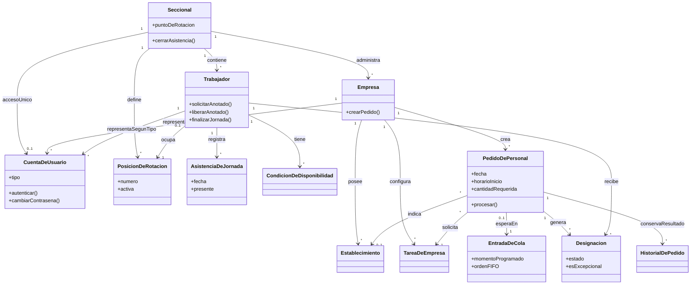
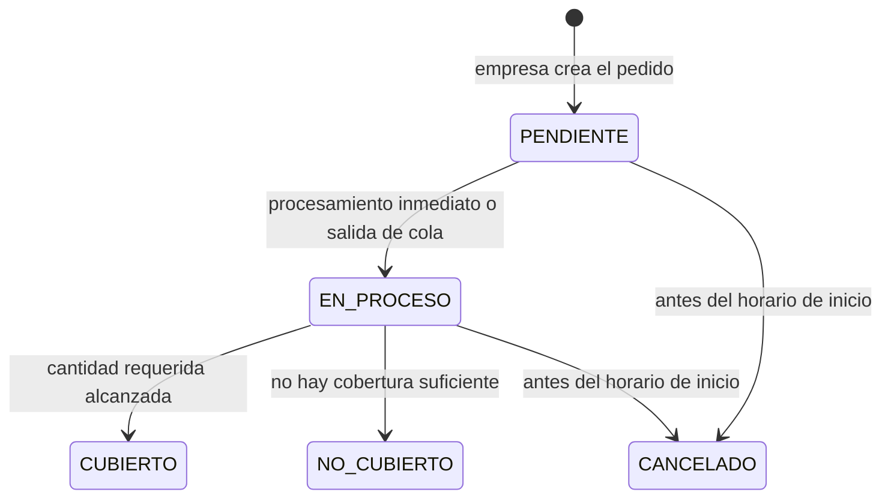
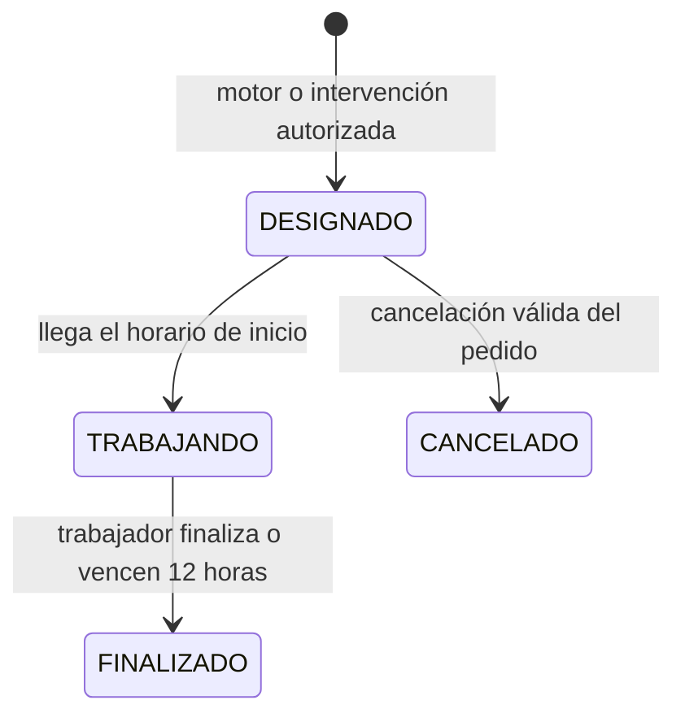
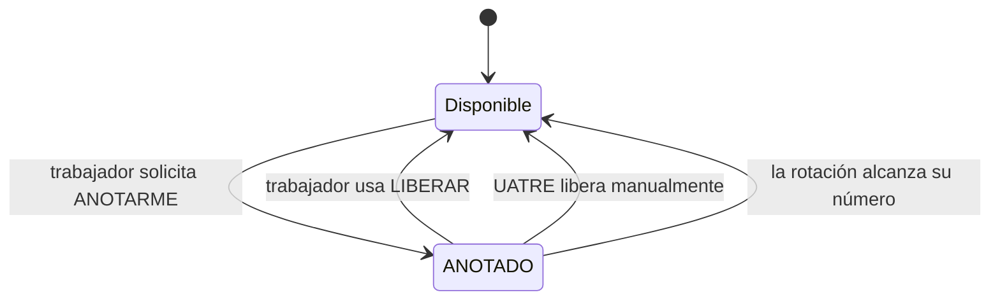

# Modelo de Dominio

# Sistema Web de Gestión y Asignación de Personal Eventual para UATRE

**Versión:** 1.0  
**Fecha:** 2026-09-22  
**Fase:** 5 — Modelo de dominio  
**Propósito:** Representar los conceptos, responsabilidades, relaciones y ciclos de vida del negocio sin definir todavía su persistencia, API o interfaz.

---

## 1. Alcance y fuentes de verdad

Este modelo conceptual se deriva de:

- [business-rules.md](./business-rules.md): reglas de comportamiento del dominio;
- [requirements.md](./requirements.md): funcionalidades requeridas;
- [uc-uatre.md](./uc-uatre.md), [uc-empresa.md](./uc-empresa.md) y [uc-trabajador.md](./uc-trabajador.md): interacciones de los actores.

No es un modelo físico: los nombres de las entidades no prescriben tablas, claves, columnas, endpoints ni pantallas. Esos aspectos se definirán en las fases de diseño de base de datos, arquitectura, API y frontend.

---

## 2. Contexto y límites del dominio

Una **Seccional** opera de manera independiente: administra sus trabajadores, empresas, lista de rotación, asistencia, pedidos y asignaciones. Ninguna operación de una seccional puede afectar datos ni decisiones operativas de otra.

El dominio se divide en cuatro áreas:

| Área | Responsabilidad |
| --- | --- |
| Identidad y administración | Representar las seccionales, empresas, trabajadores, cuentas y establecimientos. |
| Disponibilidad y rotación | Mantener asistencia, indisponibilidad voluntaria, atrasos, sanciones, habilitaciones y posición de rotación. |
| Pedidos y nombramiento | Recibir pedidos, decidir su momento de procesamiento y cubrirlos mediante el motor de nombramiento. |
| Consulta e historial | Exponer el pizarrón operativo y preservar el resultado histórico de los pedidos. |

---

## 3. Entidades y conceptos principales

### 3.1 Seccional

Representa una sede operativa de UATRE.

**Responsabilidades:**

- delimitar el ámbito de empresas, trabajadores, pedidos y lista de rotación;
- mantener el punto actual de la rotación ordinaria;
- administrar la jornada y el cierre de asistencia.

**Invariantes:**

- su número identificatorio es único;
- cada empresa, trabajador y pedido pertenece a una única seccional;
- el punto de rotación se modifica únicamente por una designación de rotación ordinaria (no por prioridad de atrasados ni por coberturas excepcionales).

### 3.2 Cuenta de usuario

Representa la identidad autenticable de un actor. Puede corresponder a una seccional, una empresa o un trabajador.

**Responsabilidades:**

- autenticar al actor;
- identificar su tipo de acceso;
- preservar el requisito de cambio de contraseña en el primer inicio de sesión.

Una cuenta pertenece a exactamente una entidad operativa según su tipo. El correo electrónico es único en todo el sistema. Cada seccional tiene una única cuenta de acceso (RN-149); el modelo permite que la relación con empresas y trabajadores evolucione a múltiples cuentas si el alcance futuro lo requiere.

### 3.3 Empresa

Representa a la organización afiliada que solicita personal eventual dentro de una seccional.

**Responsabilidades:**

- crear, consultar, modificar y cancelar sus propios pedidos;
- indicar el establecimiento de trabajo cuando corresponda;
- recibir el resultado de cobertura sin acceder a datos internos de rotación ni a la identidad de los trabajadores.

Una empresa puede tener varios establecimientos y muchos pedidos, pero pertenece a una sola seccional.

### 3.4 Establecimiento

Representa el lugar al que deberán concurrir los trabajadores para cumplir un pedido. Pertenece a una empresa y puede mantenerse activo o inactivo. Un pedido puede referenciar el establecimiento elegido por la empresa.

### 3.5 Tarea de empresa

Representa un tipo de trabajo configurable para una empresa por personal autorizado de UATRE. Pertenece a una única empresa y puede mantenerse activo o inactivo. Cada pedido debe referenciar una tarea configurada de la empresa que lo crea.

### 3.6 Trabajador

Representa a la persona que puede participar en la asignación de trabajo eventual dentro de una seccional.

**Responsabilidades:**

- mantener su identidad, condición activa y número de lista cuando lo tenga;
- registrar su asistencia diaria;
- solicitar o liberar su indisponibilidad ANOTADO;
- consultar su estado, pizarrón y designaciones propias;
- finalizar anticipadamente una jornada cuando está trabajando.

El documento es único globalmente. Un trabajador puede acumular historial de asistencia y designaciones, pero solo mantiene una condición vigente de atrasos y una de sanción a la vez.

### 3.7 Posición de rotación

Representa un número fijo y reutilizable de la lista de una seccional. No representa la identidad permanente de un trabajador.

**Responsabilidades:**

- determinar el orden circular de la rotación ordinaria;
- asociar opcionalmente un trabajador activo;
- permitir que un número quede libre o inactivo sin eliminar su significado histórico.

La lista se conserva ordenada y no se reestructura durante el funcionamiento ordinario.

### 3.8 Asistencia de jornada

Representa la presencia o ausencia de un trabajador en una fecha concreta.

**Responsabilidades:**

- conservar el registro diario de asistencia;
- aportar la condición de presencia actual y anterior requerida por el motor;
- participar en el cierre de asistencia de la jornada.

La asistencia no altera la posición del trabajador en la lista de rotación.

### 3.9 Condiciones de disponibilidad

Son conceptos que modifican temporalmente la elegibilidad de un trabajador:

| Condición | Significado | Efecto principal |
| --- | --- | --- |
| **ANOTADO** | Indisponibilidad voluntaria solicitada por el trabajador. | Impide su designación mientras esté vigente; no elimina atrasos. |
| **Atraso** | Turnos pendientes que reconocen una postergación operativa. | Puede dar prioridad antes de la rotación ordinaria si cumple las demás condiciones. |
| **Sanción** | Turnos de sanción pendientes. | Bloquea la prioridad de atraso y la designación ordinaria. |
| **Inhabilitación** | Prohibición para una pareja trabajador-empresa. | Impide futuras designaciones para esa empresa, sin afectar otras. |

Estas condiciones son independientes entre sí y pueden coexistir. Su efecto final se determina por las reglas de elegibilidad del motor: por ejemplo, ANOTADO y una sanción prevalecen temporalmente sobre la prioridad de un atraso.

### 3.10 Pedido de personal

Representa una solicitud de trabajadores creada por una empresa.

**Responsabilidades:**

- especificar fecha, horario de inicio, cantidad requerida, tarea y establecimiento cuando corresponda;
- determinar si debe procesarse inmediatamente o esperar en cola;
- reflejar la cobertura lograda;
- generar designaciones para cubrir sus puestos.

Un pedido pertenece a una empresa y, por ella, a una seccional. Puede tener cero o muchas designaciones.

### 3.11 Entrada de cola

Representa la espera de un pedido hasta que exista un estado válido de la lista para procesarlo.

**Responsabilidades:**

- conservar el momento programado de procesamiento;
- resolver pedidos habilitados en orden FIFO;
- dejar de aplicar cuando el pedido se procesa o cancela.

Un pedido tiene como máximo una entrada de cola activa.

### 3.12 Designación

Representa el compromiso de un trabajador para cubrir un puesto de un pedido.

**Responsabilidades:**

- vincular un trabajador, un pedido y el horario laboral;
- impedir nuevas asignaciones incompatibles mientras permanezca vigente;
- registrar si fue ordinaria o excepcional;
- transitar por los estados de trabajo y conservar el resultado final.

La designación es el único concepto que transforma una selección del motor en un compromiso laboral concreto.

### 3.13 Pizarrón operativo e historial de pedido

El **Pizarrón operativo** es una vista del estado de la jornada: muestra pedidos operativos y, según el actor, información permitida de disponibilidad y cobertura. No es una fuente independiente de verdad.

El **Historial de pedido** es una instantánea del resultado final del pedido al cierre de jornada. Preserva cantidades, estado y datos necesarios de consulta, pero no pretende reconstruir todas las decisiones internas del motor.

---

## 4. Relaciones conceptuales

Las tres asociaciones de `CuentaDeUsuario` son excluyentes: una cuenta representa solo una de esas entidades de acuerdo con su tipo. La asociación de Seccional está limitada a una cuenta vigente por seccional; las otras cardinalidades podrán ampliarse en el futuro conforme a RN-150.

---

## 5. Estados y ciclos de vida

### 5.1 Pedido

`PENDIENTE`, `EN_PROCESO`, `CUBIERTO`, `NO_CUBIERTO` y `CANCELADO` son estados operativos. La presentación para Empresa simplifica esa información y nunca revela la identidad ni los números de los trabajadores designados.

### 5.2 Designación

- `DESIGNADO` y `TRABAJANDO` son estados distintos.
- Al entrar en `TRABAJANDO`, comienza el bloqueo laboral.
- La finalización manual puede ocurrir antes de las 12 horas; el sistema la realiza automáticamente al vencimiento si todavía sigue trabajando.
- Una cancelación válida revierte la vigencia de las designaciones afectadas y aplica sus efectos sobre atrasos.

### 5.3 ANOTADO

La salida de ANOTADO no consume ni elimina atrasos pendientes.

---

## 6. Servicios y políticas del dominio

### 6.1 Servicio de decisión de procesamiento

Al crear o reprogramar un pedido, determina si se procesa de inmediato o se incorpora a la cola. La decisión considera la fecha y horario del pedido respecto del cierre de asistencia de las 07:40.

### 6.2 Motor de nombramiento

Es un servicio de dominio que cubre un pedido mediante fases ordenadas:

1. trabajadores atrasados elegibles;
2. rotación ordinaria circular;
3. cobertura excepcional en sus etapas autorizadas.

Cada fase evalúa asistencia, ANOTADO, sanciones, habilitación para la empresa, designaciones/trabajos vigentes y atrasos. El motor crea designaciones y actualiza el estado final del pedido; no expone a la empresa la lógica de selección.

### 6.3 Política de elegibilidad

Centraliza las restricciones para determinar si un trabajador puede ser designado en un pedido y en una fase particular. Debe mantener separados:

- asistencia diaria;
- condición de disponibilidad;
- condición de designación;
- condición de trabajo;
- prioridad por atrasos;
- habilitación específica para la empresa.

### 6.4 Servicio de cierre de jornada

Valida y cierra la asistencia, actualiza las condiciones que dependen de ella, habilita el procesamiento de pedidos en cola y conserva las instantáneas históricas necesarias.

---

## 7. Invariantes transversales

1. Una empresa solo puede administrar y consultar sus propios pedidos.
2. Un trabajador solo puede consultar su información, sus designaciones y acciones de disponibilidad propias.
3. La empresa nunca accede a identidad, números, criterios de selección ni posición de rotación de trabajadores.
4. ANOTADO impide una designación, incluso en la cobertura excepcional.
5. Un trabajador DESIGNADO o TRABAJANDO no puede recibir una nueva designación incompatible.
6. La prioridad de atrasos no altera el punto de rotación ordinaria.
7. Un pedido no puede modificarse una vez que tiene personal asignado.
8. Un pedido no puede cancelarse una vez alcanzado su horario de inicio.
9. Las operaciones de una seccional no se mezclan con las de otra.
10. El historial representa resultados de negocio; no debe depender de la estructura técnica que se elija posteriormente.

---

## 8. Decisiones aplazadas

La Fase 5 no resuelve decisiones de diseño posteriores. Permanecen deliberadamente abiertas:

- representación física de establecimientos;
- tablas, claves, índices, constraints, vistas, triggers y transacciones;
- módulos, servicios de aplicación y responsabilidades de frontend/backend;
- contratos HTTP, endpoints, autorización técnica y formato de errores;
- componentes, rutas y experiencia visual.

Estas decisiones deberán partir de este modelo, las reglas de negocio y los casos de uso en las fases 6 a 9.

---

## 9. Trazabilidad

| Elemento del modelo | Fuentes principales |
| --- | --- |
| Seccional, empresa, trabajador y cuenta | RN-138 a RN-151; REQ-UATRE-001, 010 y 011 |
| Posición y rotación | RN-011 a RN-028, RN-141 y RN-142 |
| Asistencia y condiciones de disponibilidad | RN-029 a RN-046, RN-099 a RN-114, REQ-UATRE-002 y 003 |
| Pedido, cola y cancelación | RN-053, RN-057 a RN-075; REQ-EMPRESA-001 a 004 |
| Designación y bloqueo laboral | RN-077 a RN-098; REQ-TRABAJADOR-007 |
| Pizarrón e historial | RN-115 a RN-122, RN-145 y RN-165; REQ-TRABAJADOR-004 a 006 |
